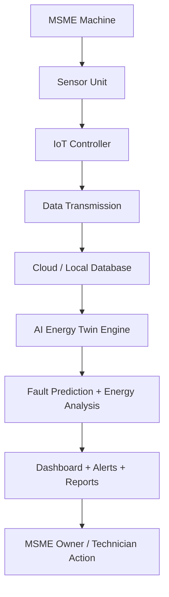

# Block Diagram

## Explanation

The machine is connected to a low-cost sensor unit that measures electrical and health parameters. The IoT controller collects readings and sends them to either a cloud server or a local gateway. The database stores machine-wise time-series data. The AI Energy Twin engine compares live readings against expected patterns and generates failure risk, idle wastage, efficiency rating, savings and carbon estimates. The dashboard converts the analysis into alerts, recommendations, reports and technician actions.
